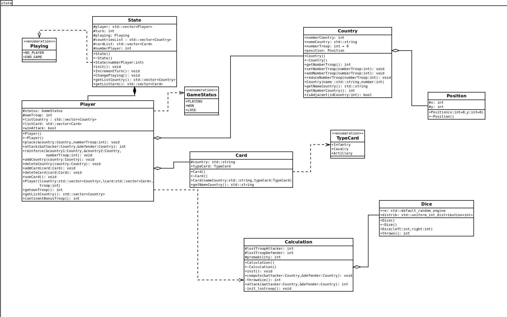

# PLT RISK

## Equipe 

* [Lasme Sam Florent DIBY](https://github.com/SaSamSa)

* [Uriel Jesussindjlo DJENONTIN AGOSSOU](https://github.com/jdjenontin)

* [Yann RICUR](https://github.com/RicurY)

* [Xiaoyu ZHAO](https://github.com/Xiaoyu367)

# 1 Objectif
## 1.1 Présentation générale
Notre projet porte sur la réalisation du jeu Risk. C’est un jeu de stratégie au tour par tour qui permet à deux à six joueurs de s’affronter. Pour notre projet nous nous limiterons à des parties à trois joueurs.

## 1.2 Règles du jeu

Le jeu se déroule sur un plateau représentant la carte du monde et divisée en plusieurs territoires, chaque joueur commence la partie avec un certain nombre de troupes placées sur la carte, et la condition de victoire la plus classique est assez simple : il faut conquérir le monde en conquérant les territoires de ses adversaires ! Il existe cependant d’autres conditions de victoire imposées par des cartes additionnelles et faisant appels à des troupes spéciales, conditions que nous n’implémenterons pas dans notre première version du jeu.

Le tour de chaque joueur se déroule en trois parties. Tout d’abord la phase de fortification, durant cette phase, le joueur a un certain nombre de troupes à répartir entre les territoires qu’il possède déjà, ce nombre est déterminé par le nombre de territoire que le joueur possède déjà. Puis il passe à la phase d’attaque, durant cette phase le joueur peut attaquer à partir de n’importe lequel de ses territoires possédant deux troupes ou plus, tout territoire adversaire avec qui il partage une frontière. Le joueur choisi ensuite s’il veut attaquer avec une, deux ou trois troupes en sachant qu’il doit laisser au moins une troupe sur son territoire, le défenseur choisi s’il veut défendre avec une ou deux troupes. Les deux joueurs lancent un nombre de dés correspondant au nombre de troupes qu’ils mettent chacun en jeu (3 max pour l’attaquant et 2 max pour le défenseur donc) et ils comparent leur plus haut lancé et le vaincu perd une troupe, puis leurs deuxième plus haut lancés s’il y a deux défenseurs, noté qu’en cas d’égalité des lancés le défenseur l’emporte. S’il ne reste plus de troupes sur le territoire du défenseur, l’attaquant s’empare de ce territoire et y déplace au moins autant de troupes qu’il a utilisé pour son attaque. Pour limiter la durée des parties, nous implémenterons une seule forme d’attaque qui consiste en des lancés successives de dés impliquant la totalité des troupes moins 1 sur le territoire attaquant et la totalité des troupes sur le territoire attaqué. La dernière phase est la phase de manœuvres. Durant cette phase, le joueur peut faire un déplacement d’autant de troupes qu’il veut d’un de ses territoires vers un autre territoire qui lui appartient et qui est frontalier à ce premier territoire en n’oubliant pas qu’il faut toujours au moins une troupe sur chaque territoire à tout moment de la partie.

## 1.3 Environnement de développement

Nous développons notre jeu en C++ dans un environnement Linux Ubuntu avec l'IDE Visual Studio Code. 

# 2 Desciption et conception es états

## 2.1 Description des états

L'état du jeu est défini par les joueurs et leurs possesions : Pays et Cartes.

### 2.1 Les Joueurs

Le nombre de joueur est défini au début de chaque partie, l'état initiale du jeu varie en fonction du nombre de joueurs impliqué.
Dans le cadre de notre projets nous implémenterons dans un premier temps des parties impliquant 3 joueurs puis dans un second temps des parties impliquants entre 2 et 5 joueurs.
Pour une partie impliquant:
* 2 joueurs : Chaque joueur dispose au début de la partie de 21 territoires et de 45 soldats.
* 3 joueurs : Chaque joueur dispose au début de la partie de 14 territoires et de 35 soldats.
* 4 joueurs : Les deux premiers joueurs disposent de 11 territoires chacun et les deux derniers disposent de 10 territoires chacun; tous les joueurs disposent de 30 soldats chacun.
* 5 joueurs : Les deux premiers joueurs disposent de 9 territoires chacun et les trois derniers disposent de 8 territoires chacun; tous les joueurs disposent de 25 soldats chacun.

Un joueur perd la partie lorsqu'il n'a plus territoire et gagne lorsqu'il a tous les territoires.

### 2.1 Les territoires

Au nombre de 42 au total, les territoires sont distribués de façon aléatoire entre les divers joueurs. Chaque territoire possède un certain nombre de troupes. Les troupes servent notament à attaquer un territoire limistrophe ou à défendre le territoire en cas d'attaque.

### 2.3 Les cartes

Au nombre de 42 aussi, elles sont de 3 types : Infantry, Cavalry et Artillery. Chaque carte est associé à un pays.
Les cartes sont distribué une à une et de façon aléatoire à chaque tour de jeu. Lorsqu'un joueur possède les 3 types de cartes il peut les échanger contre des troupes bonus.

## 2.2 Conception logiciel

Le diagramme des classes pour les états est présenté à la figure ci dessous.

La classe principale du package **state** est State. Elle décrit l'état du jeu à chaque instant.

Les éléments de l'état du jeu , décrits à la section précédentes sont représentés par les classes suivantes :

| Element | Classe  |
|---------|---------|
|Joueur   | Player  |
|Terrioire| Country |
|Carte    | Card    |

A ces classes s'ajoutent :

* La classe **Calculation** qui regroupe un ensemble de méthodes qui s'occupent des divers calculs aléatoires nécessaire au bon déroulement du jeu

* La classe **Dice**, composant de Calculation, qui reproduit le comportement d'un dé

* La classe **Position** composante de Country qui stock la les coordonées de chaque territoire sur la map de jeu qui sera définie dans la partie graphique.
