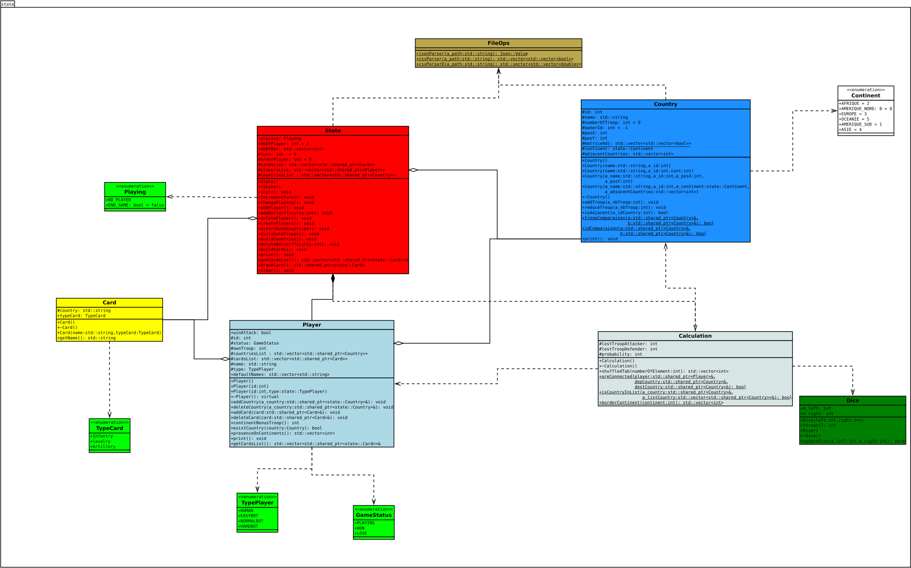
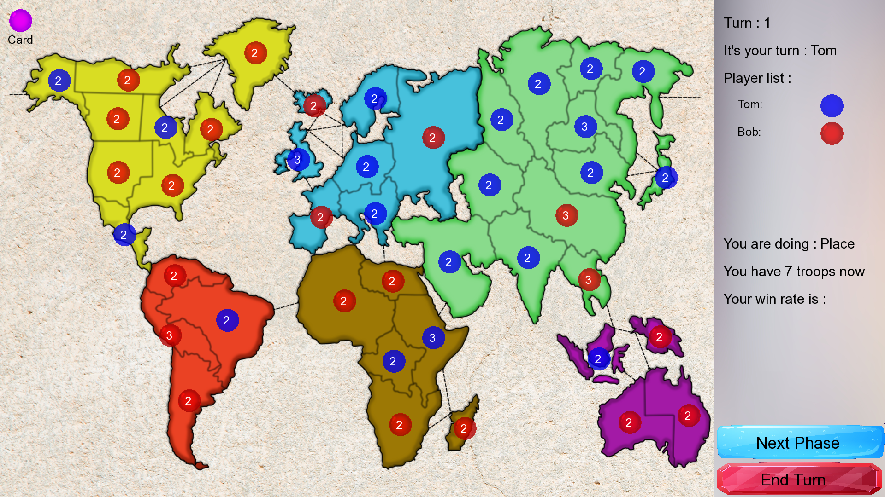
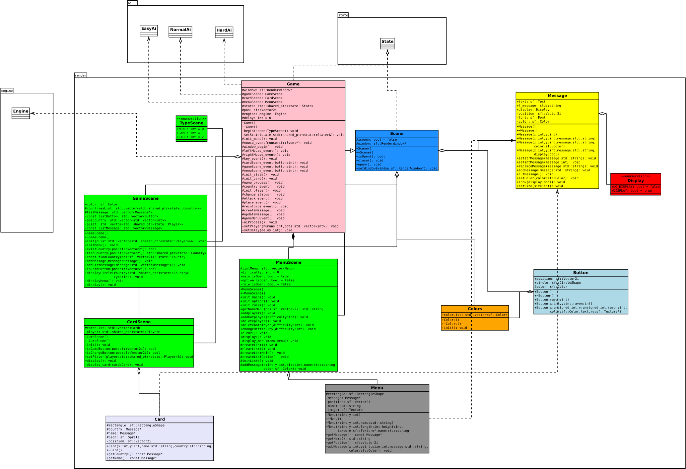

# PLT RISK

## Equipe 

* [Lasme Sam Florent DIBY](https://github.com/SaSamSa)

* [Uriel Jesussindjlo DJENONTIN AGOSSOU](https://github.com/jdjenontin)

* [Yann RICUR](https://github.com/RicurY)

* [Xiaoyu ZHAO](https://github.com/Xiaoyu367)

# 1 Objectif
## 1.1 Présentation générale
Notre projet porte sur la réalisation du jeu Risk. C’est un jeu de stratégie au tour par tour qui permet à deux à six joueurs de s’affronter. Pour notre projet nous nous limiterons à des parties à trois joueurs.

## 1.2 Règles du jeu

Le jeu se déroule sur un plateau représentant la carte du monde et divisée en plusieurs territoires, chaque joueur commence la partie avec un certain nombre de troupes placées sur la carte, et la condition de victoire la plus classique est assez simple : il faut conquérir le monde en conquérant les territoires de ses adversaires ! Il existe cependant d’autres conditions de victoire imposées par des cartes additionnelles et faisant appels à des troupes spéciales, conditions que nous n’implémenterons pas dans notre première version du jeu.

Le tour de chaque joueur se déroule en trois phases. Tout d’abord la phase de fortification, durant cette phase, le joueur a un certain nombre de troupes à répartir entre les territoires qu’il possède déjà, ce nombre est déterminé par le nombre de territoire que le joueur possède déjà. Puis il passe à la phase d’attaque, durant cette phase le joueur peut attaquer à partir de n’importe lequel de ses territoires possédant deux troupes ou plus, tout territoire adversaire avec qui il partage une frontière. Le joueur choisi ensuite s’il veut attaquer avec une, deux ou trois troupes en sachant qu’il doit laisser au moins une troupe sur son territoire, le défenseur choisi s’il veut défendre avec une ou deux troupes. Les deux joueurs lancent un nombre de dés correspondant au nombre de troupes qu’ils mettent chacun en jeu (3 max pour l’attaquant et 2 max pour le défenseur donc) et ils comparent leur plus haut lancé et le vaincu perd une troupe, puis leurs deuxième plus haut lancés s’il y a deux défenseurs, noté qu’en cas d’égalité des lancés le défenseur l’emporte. S’il ne reste plus de troupes sur le territoire du défenseur, l’attaquant s’empare de ce territoire et y déplace au moins autant de troupes qu’il a utilisé pour son attaque. Pour limiter la durée des parties, nous implémenterons une seule forme d’attaque qui consiste en des lancés successives de dés impliquant la totalité des troupes moins 1 sur le territoire attaquant et la totalité des troupes sur le territoire attaqué. La dernière phase est la phase de manœuvres. Durant cette phase, le joueur peut faire un déplacement d’autant de troupes qu’il veut d’un de ses territoires vers un autre territoire qui lui appartient et qui est frontalier à ce premier territoire en n’oubliant pas qu’il faut toujours au moins une troupe sur chaque territoire à tout moment de la partie.

## 1.3 Environnement de développement

Nous développons notre jeu en C++ dans un environnement Linux Ubuntu avec l'IDE Visual Studio Code. 

# 2 Desciption et conception es états

## 2.1 Description des états

L'état du jeu est défini par les joueurs et leurs possessions : Pays et Cartes.

### 2.1.1 Les Joueurs

Le nombre de joueur est défini au début de chaque partie, l'état initiale du jeu varie en fonction du nombre de joueurs impliqué.
Dans le cadre de notre projets nous implémenterons dans un premier temps des parties impliquant 3 joueurs puis dans un second temps des parties impliquants entre 2 et 5 joueurs.
Pour une partie impliquant:
* 2 joueurs : Chaque joueur dispose au début de la partie de 21 territoires et de 45 soldats.
* 3 joueurs : Chaque joueur dispose au début de la partie de 14 territoires et de 35 soldats.
* 4 joueurs : Les deux premiers joueurs disposent de 11 territoires chacun et les deux derniers disposent de 10 territoires chacun; tous les joueurs disposent de 30 soldats chacun.
* 5 joueurs : Les deux premiers joueurs disposent de 9 territoires chacun et les trois derniers disposent de 8 territoires chacun; tous les joueurs disposent de 25 soldats chacun.

Un joueur perd la partie lorsqu'il n'a plus territoire et gagne lorsqu'il a tous les territoires.

### 2.1.2 Les territoires

Au nombre de 42 au total, les territoires sont distribués de façon aléatoire entre les divers joueurs. Chaque territoire possède un certain nombre de troupes. Les troupes servent notament à attaquer un territoire limistrophe ou à défendre le territoire en cas d'attaque.

### 2.1.3 Les cartes

Au nombre de 42 aussi, elles sont de 3 types : Infantry, Cavalry et Artillery. Chaque carte est associé à un pays.
Les cartes sont distribué une à une et de façon aléatoire à chaque tour de jeu. Lorsqu'un joueur possède les 3 types de cartes il peut les échanger contre des troupes bonus.

## 2.2 Conception logiciel

Le diagramme des classes pour les états est présenté à la figure ci dessous.

La classe principale du package **state** est State. Elle décrit l'état du jeu à chaque instant.

Les éléments de l'état du jeu , décrits à la section précédentes sont représentés par les classes suivantes :

| Element | Classe  |
|---------|---------|
|Joueur   | Player  |
|Terrioire| Country |
|Carte    | Card    |

A ces classes s'ajoutent :

* La classe **Calculation** qui regroupe un ensemble de méthodes qui s'occupent des divers calculs aléatoires nécessaire au bon déroulement du jeu

* La classe **Dice**, composant de Calculation, qui reproduit le comportement d'un dé

* La classe **Position** composante de Country qui stock la les coordonées de chaque territoire sur la map de jeu qui sera définie dans la partie graphique.

* La classe **FileOps**, qui est une classe servant à faire des opérations sur les fichiers nécessaires à l'initialisation du jeu 

# 3 Rendu : Stratégie et Conception

## 3.1 Stratégie de rendu d'un état

Pour le rendu d'un état, nous avons opté pour la réalisation de deux scènes : 

### La scène d'accueil 
Cette scène est composé, pour l'instant, de 5 bouttons 
* **Start** pour lancer une partie
* **Option** permet d'ajouter des joueurs et des bots.
* **Rule** Affiche les régles du jeu 
* **About** Affiche la page github du projet
* **Quit** Permet de quitter le jeu

### La scène de jeu 

Ici, nous nous servons d'une map du jeu fixe, celle-ci est représentée dans le rendu par une image de même taille que la fenêtre de jeu. 
Nous supperposons ensuite sur cette image :
* Le nombre de soldats présents sur chaque territoire dans des "bulles" en nous servant des coordonnées du territoire dans la fenêtre. Chaque bulle a une couleur permettant d'identifier le joueur détenteur du territoire.
* Les informations de jeu sont affichées dans la colonne de droite 

## 3.2 Conception logiciel

Le diagramme des classes pour le rendu est le suivant :

* **Colors** : La classe colors définie une liste des couleurs utilisées dans le jeu à l'aide de leurs compositions RGBa.
* **Message** : La classe Message est l'une des classe de base du rendu, cette classe est utilisée pour afficher des chaines de caractères sur les différentes scènes. Elle dispose de divers constructeurs pour créer des Message à une position donnée de la scène ou encore pour définir la couleur du message à créer.
* **Button** : La classe Button est une classe qui permet de définir les éléments cliquable de l'interface.
* **Menu** : La classe Menu est utilisé pour créer des éléments de menu, cliquable et portant un texte.
* **MenuScene** : MenuScene est la classe qui se charge d'afficher la scène d'acceuil, elle est composée d'éléments de type Menu.
* **GameScene** : GameScene est la classe qui se charge d'afficher la scène de jeu.
* **CardScene** : CardScene est la classe qui se charge de l'affichage des cartes
* **Scene** est la classe mère de MenuScene, GameScene, CardScene.

# 4. Moteur de jeu

## 4.1 Changement d'états

Chaque tour de jeu se déroule en trois étapes majeures : **Distrubition** (Place), **Attaque** (Attack) et **Renforcement** (Reinforce). Le passage de l'état Distribution à l'état Attaque se fait de manière automatique dès que le joueur n'a plus de troupe à distribuer. Tous les autres changements d'état se font sur l'action des joueurs à travers les commandes.

## 4.2 Conception logiciel

Pour le moteur de Jeu, nous avons opter pour un pattern Strategy. Les classe Place (pour distribuer), Attack (pour attaquer), Reinforce (pour renforcer), DistributeCard (pour la distribution de carte) et UseCard(Pour utiliser les cartes) héritent toutes de la classe Command et implémentent toutes une méthode **execute()** qui sert à lancer l'action correspondante à la commande.
Chacune de ses classes à travers son action engendre des moditicaton sur le state.

Le diagramme UML du package engine se présente comme suit:

# 5 Intelligence Artificielle

## 5.1 Conception logiciel

### 5.1.1 Intelligence aléatoire

Cette stratégie consiste en des choix aléatoires à chaque étape du jeu.

* **Distribution** Pour la phase de ditribution, l'ia choisit au hasard le pays où elle souhaite positionner ses troupes parmi la liste des pays dont elle dispose.

* **Attaque** Pendant la phase d'attaque, l'IA choisit au hasard le pays à partir duquel elle souhaite mener son attaque. Puis choisie le pays qu'elle souhaite attaquer de façon random parmi les pays adjacents au premier pays choisi. Elle décide ensuite, toujours de façon aléatoire, si elle souhaite effectuer d'autres. Ce processus est effectué en boucle jusqu'au moment où elle décide de ne plus attaquer ou n'est plus en mesure d'attaquer.

* **Renforcer** Durant cette phase, l'ia choisit de façon aléatoire 2 de ses pays : un pays de départ et un pays de destination. Elle choisie ensuite le nombre de soldat qu'elle souhaite déplacer entre les 2 pays toujours aléatoirement.

### 5.1.2 L'IA Heuristique/Normale

Cette IA contrairement à l'IA aléatoire a une stratégie précise. 
Si l'IA ne possède aucun continent entier, elle va se concentrer sur le continent sur lequel elle possède le plus de pays. Elle va ainsi placer, attaquer et renforcer les pays de ce continent jusqu'à ce qu'elle possède le continent.
Dans le cas ou l'IA possède au moins un continent entier, elle va se concentrer sur la conquête du continent frontalier ayant le moins de pays. Elle va donc placer des troupes dans le pays frontalier à ce continent et attaquer à partir de ce pays puis si l'attaque réussi, elle va déplacer ses troupes vers le pays qu'elle viens de conquérir. Elle va continuer d'attaquer ainsi jusqu'à ce que le continent lui appartienne.

### 5.1.3 L'IA avancée

* **Distribution** Pour la phase de distribution, l'IA place ses troupes dans les pays qui ont un Border Security Ratio (BSR) élevé. Le BSR d'un pays est égale à la somme des troupes énnemies dans les pays limitrophes divisée par le nombre de troupe dans le pays. Cette valeur qui permet de quantifier le risque qu'à un pays d'être perdu suite à une attaque.

* **Attaque** Lors de la phase d'attaque, l'IA détermine les routes d'attaques possible et choisit celle qui rapporte le plus de bonus troupe au tour suivant. Les attaques ne sont effectuées que si la probabilité de victoire est supérieure à 
60%

* **Renforcer** La stratégie de renforcement consiste à renforcer les pays les plus suceptibles d'être attaqués, ceux ayant le BRS le plus élevé.

## 5.2 Conception logiciel

Le diagramme des classe pour l'IA se présente comme ci-dessous.

La classe **AI** est la classe principale, d'elle hérite tous les types d'AI.

# 6. Serveur

## 6.1 Description

Notre serveur ne sert pour l'instant qu'à simuler une partie entre plusieurs IA avancées.

Il supporte des requêtes GET sur les routes suivantes:

* **/** : Qui retourne une page html permettant de choisir le nombre de bot. Une fois que le formulaire est soumis, la requête GET sur la route /init est appelée.

* **/init** : Retourne l'état initiale du jeu

* **/state** : Retourne l'état actuel du jeu

* **/botbattle** : Simule une phase du jeu et retourne la présence de chaque bot sur le jeu. Elle retourne le nom du gagnat en cas de victoire.

## 6.2 Conception logiciel

Pour la conception du serveur, nous utilisons la library restcpp développée par Microsoft.

Le diagramme UML 

Notre package engine se compose actuellement de 2 classes. La classe Server qui regroupe toutes les fonctions essentielles du Server. La classe DataOps regroupe deux fonctions qui permettent de faire des opérations sur les données reçus et envoyées à travers les requêtes.
